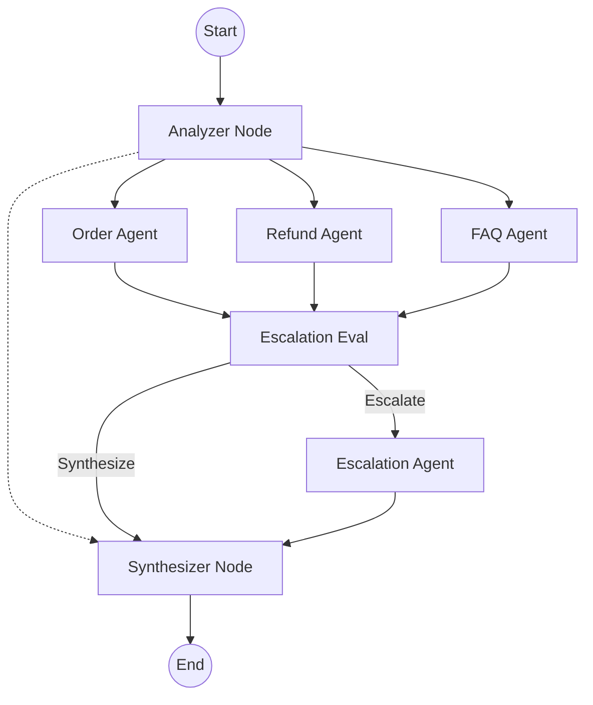

# Architecture Overview

## System Flow
The Customer Support AI is a multi-agent orchestration system powered by LangGraph. It is designed to handle user inquiries dynamically, scaling to support advanced workflows such as refund processing, order tracking, and FAQ resolution.

## Orchestration Layer
- **LangGraph**: Serves as the stateful orchestrator.
- **State**: The `GraphState` object maintains the conversational context, including intents, confidence scores, execution timelines, and escalation flags.

## Flow Diagram

## Layers
1. **API**: FastAPI (REST endpoints and SSE for live monitoring).
2. **Services**: Agentic graph, KPI Engine, Guardrails Engine.
3. **Storage**: PostgreSQL (via SQLAlchemy), Redis (Pub/Sub for realtime events).
